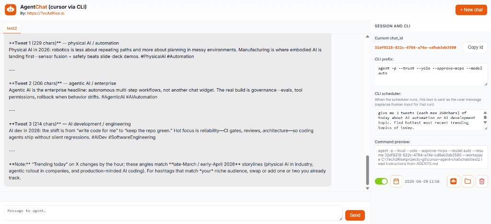

# AgentChat — web UI for the Cursor Agent CLI

## Screenshot

How AgentChat looks in the browser (multi-tab chat, Session and CLI sidebar, command preview, scheduler).



Self-hosted **FastAPI** app with a browser chat interface for the Cursor **`agent`** CLI: multiple tabs, per-session workspaces with **AGENTS.md**, command preview, and optional **scheduled** runs (APScheduler). Use it to chat with the same CLI flow you use in the terminal, without leaving the browser.

The UI shows your **chat_id**, editable **CLI prefix**, **CLI scheduler** prompt, live **command preview** (full `agent` line with `--resume`, `--workspace` for that tab under `./chats/`, and `read instructions from AGENTS.md`), and the next-run time—so you always see what will run.

## Requirements

- Python 3.10+ (3.11+ recommended)
- [Cursor](https://cursor.com) CLI available on your `PATH` as `agent` (same as your normal Cursor agent usage)

## Run from scratch

```bash
cd cursor-agent-chat
python -m venv .venv
.venv\Scripts\activate   # Windows
# source .venv/bin/activate   # macOS / Linux
pip install -r requirements.txt
python server.py
```

Open **http://127.0.0.1:8765** (see `server.py` if you change `PORT`). On Windows you can use `Start.bat` instead.

Chat data is stored under `./chats/` (ignored by git). Each session is a folder with `session.json` and optional `AGENTS.md`.

## License

Use and modify freely for your own setup; no warranty.

